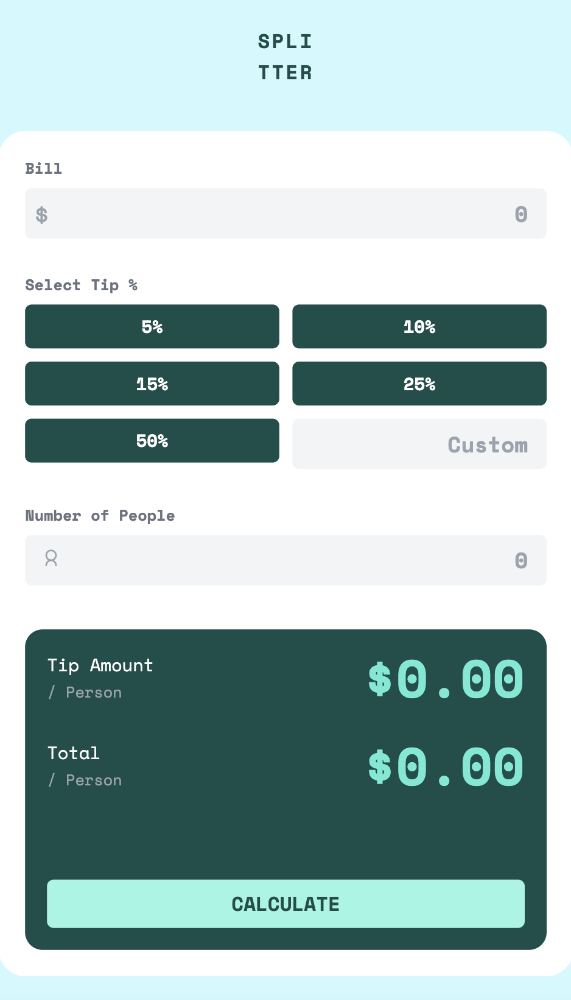

# Tip Calculator

This a Tip Calculator Built with Ruby on Rails as an implementation of the functionality of the [Frontend Mentor Tip Calculator](https://www.frontendmentor.io/challenges/tip-calculator-app-ugJNGbJUX) with an additional feature: an **Admin Dashboard** to track past calculations.  
The application is deployed at [https://rails-tip-calculator.onrender.com](https://rails-tip-calculator.onrender.com/) using [Render](https://render.com)

Desktop UI


Mobile UI


## Prerequisites

Before setting up the project, ensure you have the following installed:

- Ruby `3.2.0` or later
- Rails `8.0.0` or later
- Sqlite3 database`
- Node.js `20+`
- Yarn `1.22+`

Verify with:
```bash
ruby -v
rails -v
sqlite3 --version
node -v
yarn -v
```

## Installation
1. Clone the repository
```bash
git clone git@github.com:allandereal/rails-tip-calculator.git
cd rails-tip-calculator
```

2. Install Ruby and JavaScript dependencies:
```bash
bundle install
yarn install
```

3. Create .env file
```bash
touch .env

# and add these credentials to the .env file
ADMIN_NAME=admin
ADMIN_PASSWORD=password
```

4Run database migrations
```bash
bin/rails db:migrate
```

5. Run tests
```bash
bin/rails test
```

6. Serve the application
```bash
bin/rails server
```
and visit [http://127.0.0.1:3000](http://127.0.0.1:3000) in your browser.

### Admin access
To access the admin dashboard and access the past calculations,
visit [http://127.0.0.1:3000/admin/dashboard](http://127.0.0.1:3000/admin/dashboard) and login with the following credentials  
```code 
user: admin  
password: password
```

## My Approach to solving this task
### 1. The Model
- I created a calculator model to save the `bill` amount, `tip` percentage, and number of `people`.
- I then created 2 methods (`tip_per_person` and `total_per_person`) on the model for the Tip Amount per Person and Total per person to serve as calculated fields on the model.

### 2. The controller & Routes
- I created 2 routes, The root route to display the calculator and the admin dashboard route for the past calculations
- I added 3 controller methods, 
- 1. `index`, which is authenticated with basic auth for admins,
  2. `new` to display the calculator form.
  3. `create` to save calculations and reset the form

### 3. The Views
- I created one main view `new.html.erb` which houses the calculator form
- I added a helper and partial views for sections/components of the form that were being repeated so that i could reuse them. These include:- input field, tip percentage_totals and labels.
- I also toggled the form submit button based on the state of the calculator model. If it's a new form the button will calculate, and if its a saved model, it will reset the form.
- For the admin dashboard, I installed the `will_paginate` gem to enable pagination
- And ofcourse I installed tailwind css to beautifully style all the html components

### 4. Testing
- I wrote tests to verify that the model methods to calculate totals work as expected,
- I also wrote authentication tests for the admin dashboard to make sure that only admins can access it.
- The finally, I added tests for the create and reset controller methods, to make sure that the calculator works as intended.

